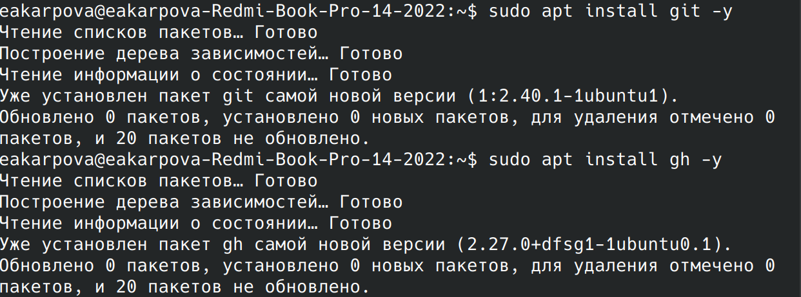
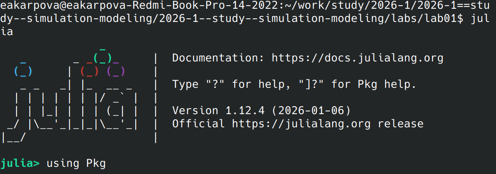
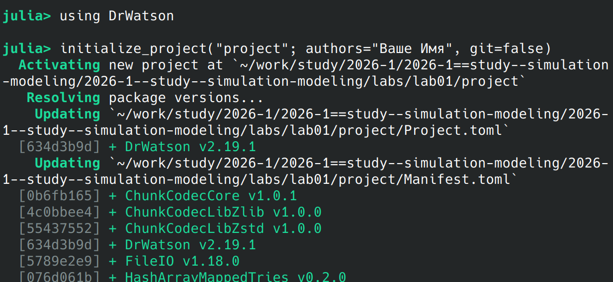

---
## Author
author:
  name: Карпова Есения Алексеевна
  degrees: DSc
  orcid: 0000-0002-0877-7063
  email: kulyabov-ds@rudn.ru
  affiliation:
    - name: Российский университет дружбы народов
      country: Российская Федерация
      postal-code: 117198
      city: Москва
      address: ул. Орджоникидзе 3
## Title
title: Лабораторная работа №1
subtitle: Математическое моделирование. Практикум
license: CC BY
date: today
date-format: "YYYY-MM-DD" # Example: 2025-09-06
---

# Вводная часть

## Цель работы

Исследовать решение обыкновенного дифференциального уравнения экспоненциального роста с использованием языка программирования Julia

## Задачи

- Настройка git и gh
- Создание проекта DrWatson для лабораторных
- Создание производных форматов

# Выполнение лабораторной работы

## Установка git

## Ключ SSH

## Добавление ключа в gitverse

## Запуск Julia

## using DrWatson

## Установка скриптом

## Результирующий график

## Результат работы скрипта

## Создание производных форматов

## Запуск Jupiter-ноутбука]

# Результаты

