---
## Author
author:
  name: Карпова Есения Алексеевна
  degrees: DSc
  orcid: 0000-0002-0877-7063
  email: 1132236008@rudn.ru
  affiliation:
    - name: Российский университет дружбы народов
      country: Российская Федерация
      postal-code: 117198
      city: Москва
      address: ул. Орджоникидзе, 3

## Title
title: "Математическое моделирование"
subtitle: "Лабораторная работа №1"
license: "CC BY"
---

# Цель работы

Исследовать решение обыкновенного дифференциального уравнения экспоненциального роста с использованием языка программирования Julia и инструментов
воспроизводимых исследований (DrWatson, Literate, Quarto), а также освоить методы параметрического анализа, визуализации и документирования
результатов вычислительного эксперимента.

# Задание

1. Настройка git и gh

2. Создание проекта DrWatson для лабораторных

3. Создание производных форматов

# Теоретическое введение

Модель экспоненциального роста описывает процесс изменения величины, скорость которого пропорциональна текущему значению. Данная модель является классическим объектом исследования в различных областях: биологии, физике, экономике и демографии. Ключевой характеристикой процесса является время удвоения — период, за который исследуемая величина увеличивается вдвое.

Численное решение дифференциального уравнения экспоненциального роста позволяет исследовать поведение системы при различных параметрах, проводить параметрический анализ и верифицировать численные методы. Сравнение численного решения с аналитической зависимостью дает возможность оценить точность выбранных алгоритмов и методов интегрирования.

# Выполнение лабораторной работы

## 1. Настройка git и gh

Проведем установку git.

Проведем базовую настройку git.

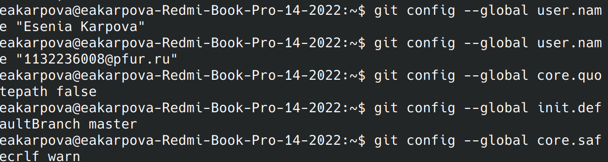

Проведем настройку gh.

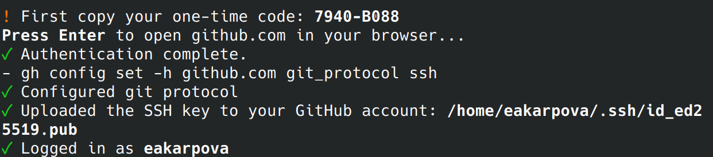

Создадим ключ SSH

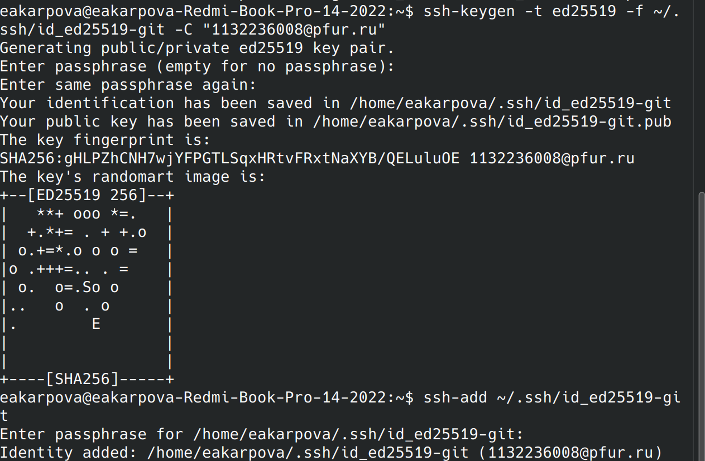

Добавим ключ в учетную запись gitverse через web-интерфейс.

Аналогично для github

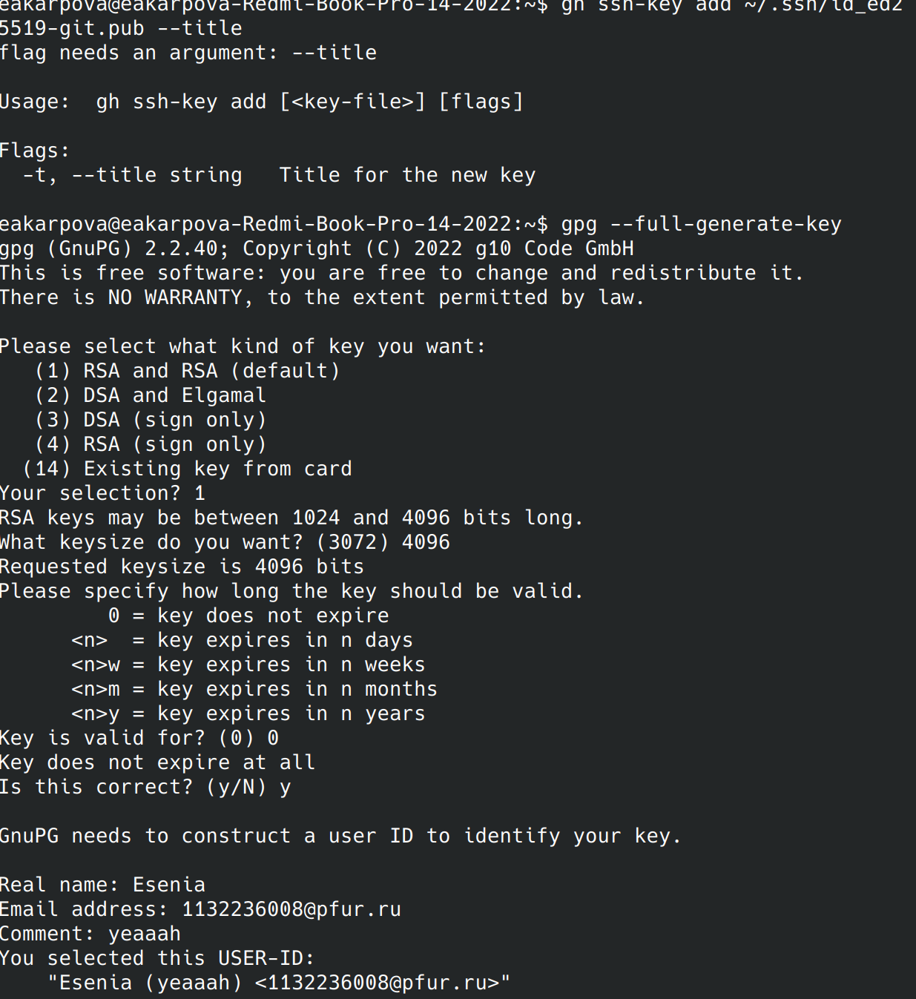

Генерируем ключ PGP

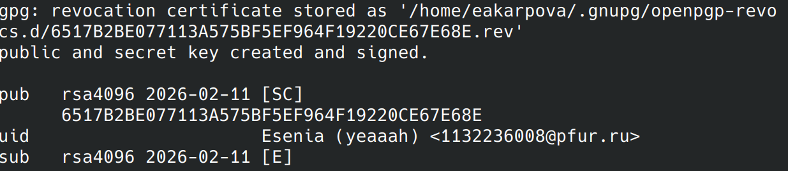

Выводим список ключей

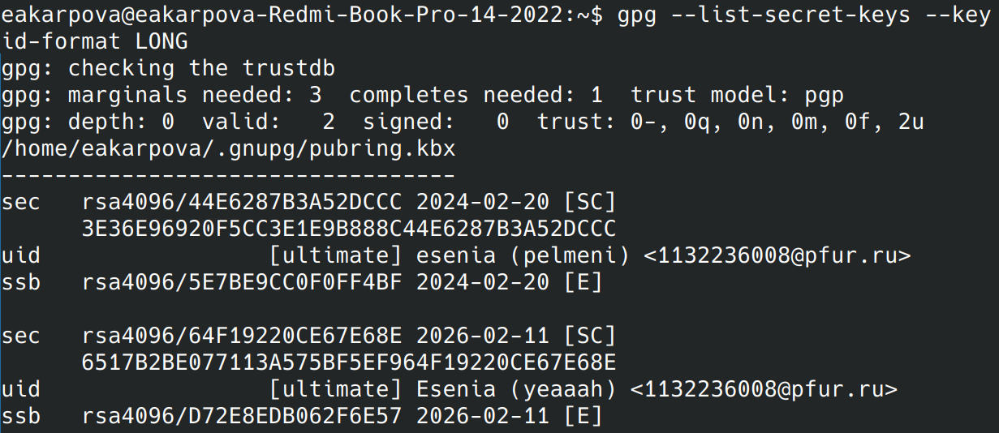

Добавление ключа GPG в github

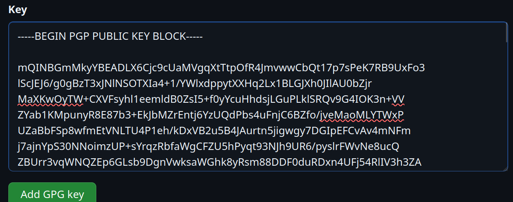

Укажем git применять email при подписи коммитов

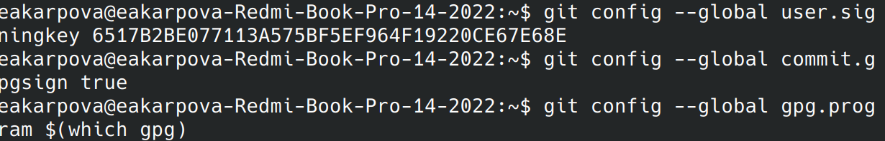

Далее создаем пространство лабораторной работы аналогично предыдущим годам обучения

## 2. Создание проекта DrWatson для лабораторных

Будем создавать проект вариантом А. Для начала запустим Julia и выполним команды в REPL

Выполним команду using Pkg

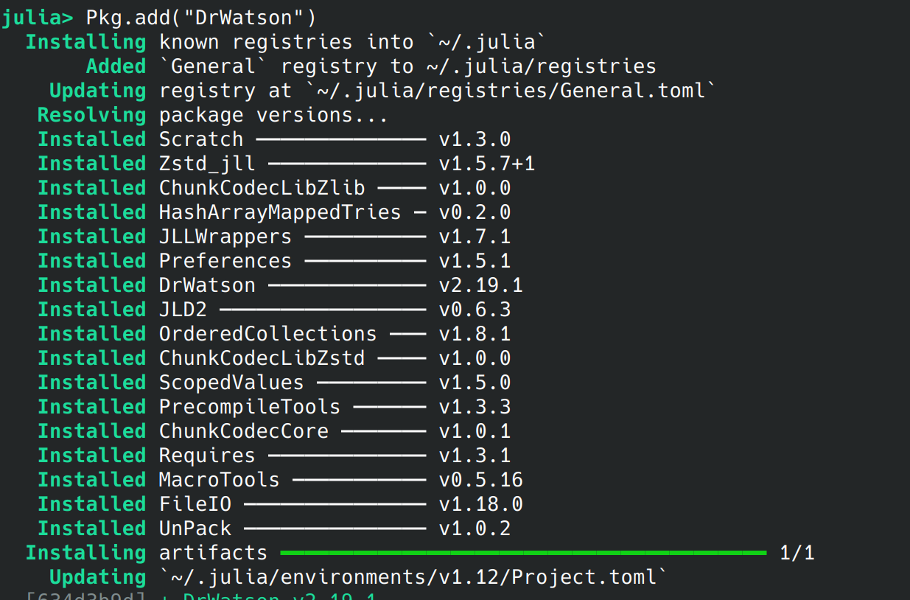

Выполним команду using DrWatson

В корне проекта файла add_packages изменим код

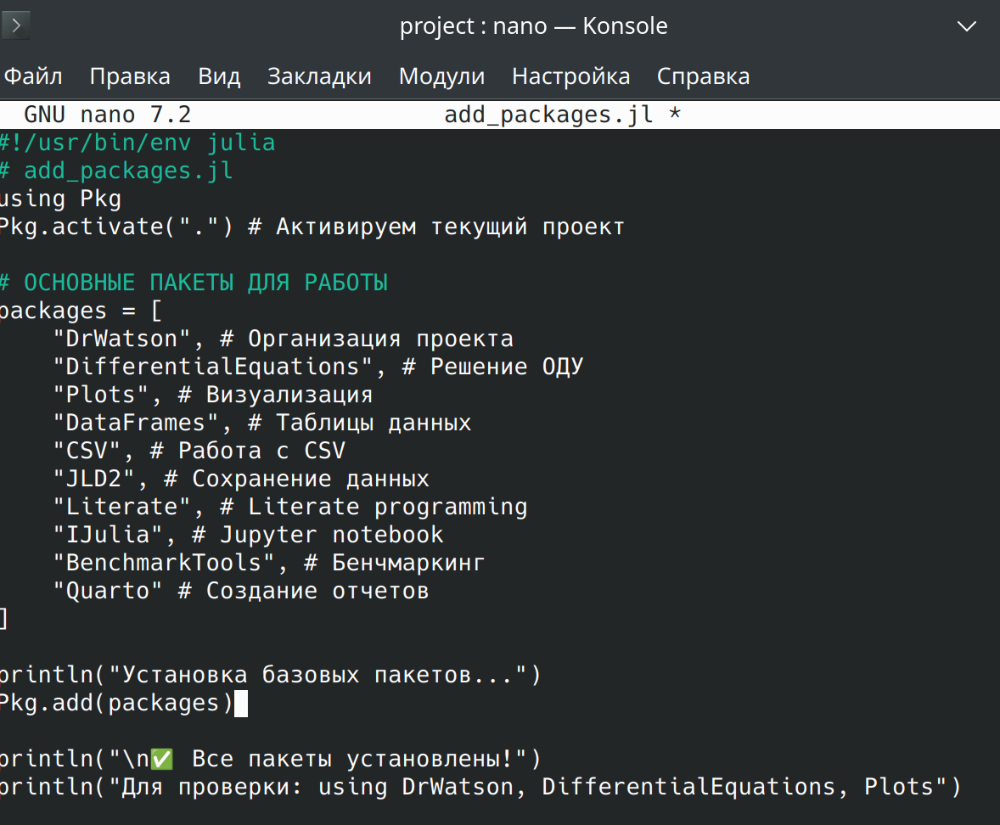

Запускаем исправленный скрипт

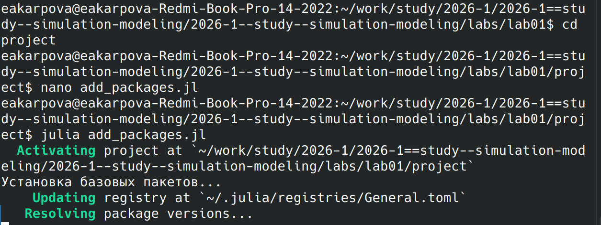

Убеждаемся, что все пакеты установленны успешно

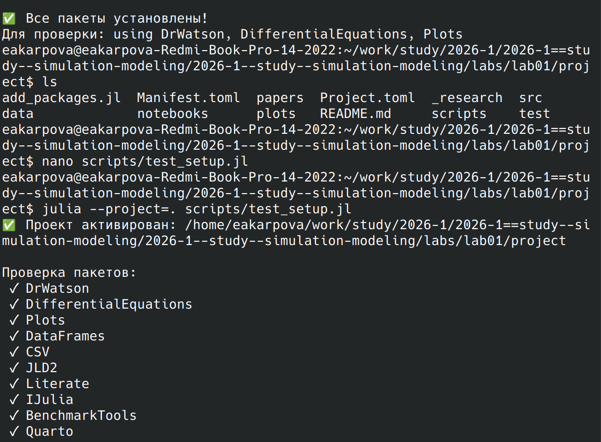

Запускаем скрипт (scripts/01_exponential_growth.jl). Получаем результирующий график в каталоге plots/

Получаем следующий результат работы скрипта

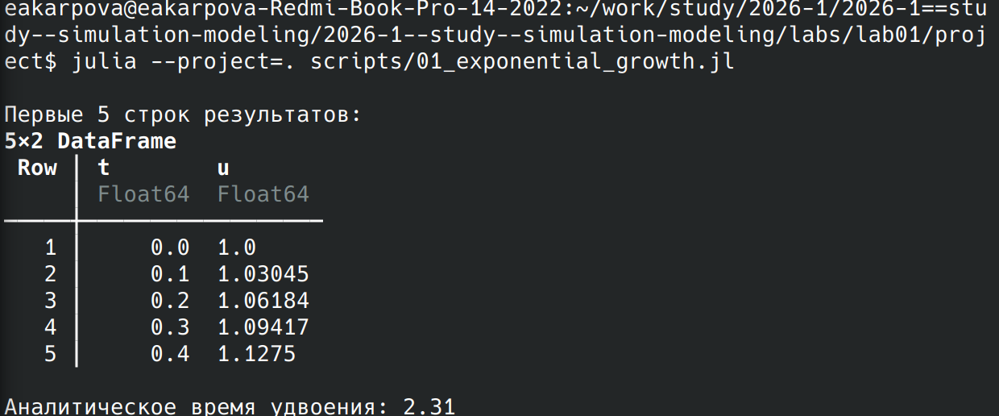

Аналогично запускаем следующий программный код файла scripts/01_exponential_growth.jl

## 3. Создание производных форматов

Создадим скрипт для генерации производных форматов (scripts/tangle.jl) и проверим его работу

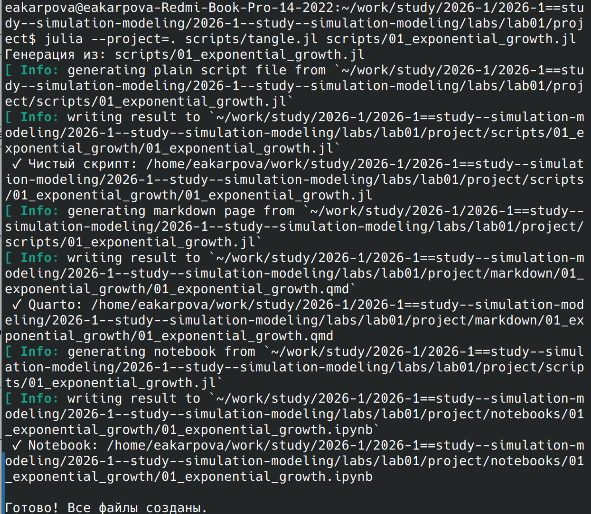

Выполним Jupiter-ноутбук через julia

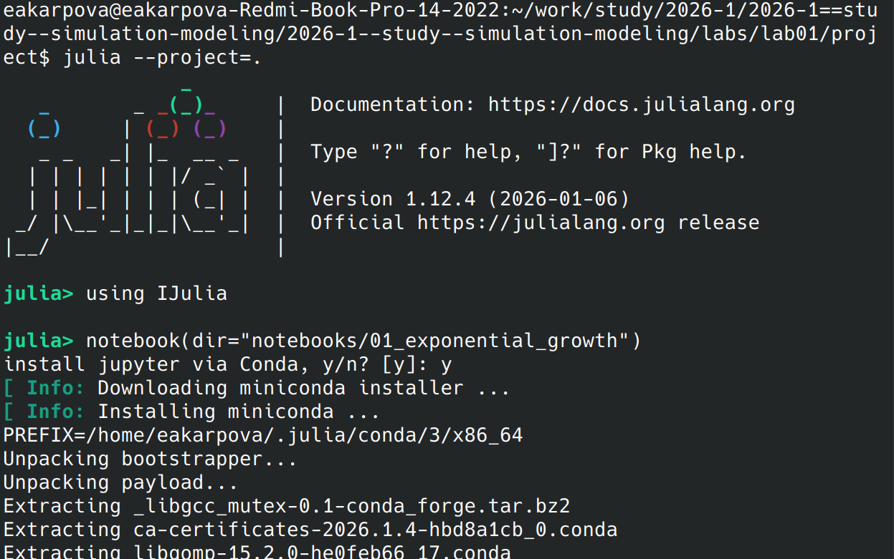

Запуск Jupiter-ноутбука

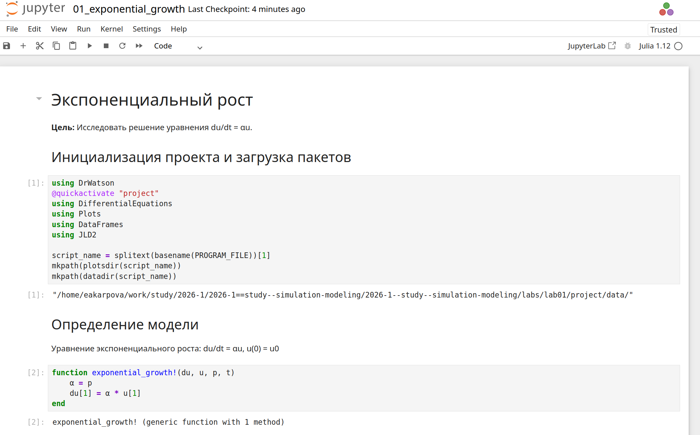

Перенесём программу в файл scripts/02_exponential_growth.jl и запустим его

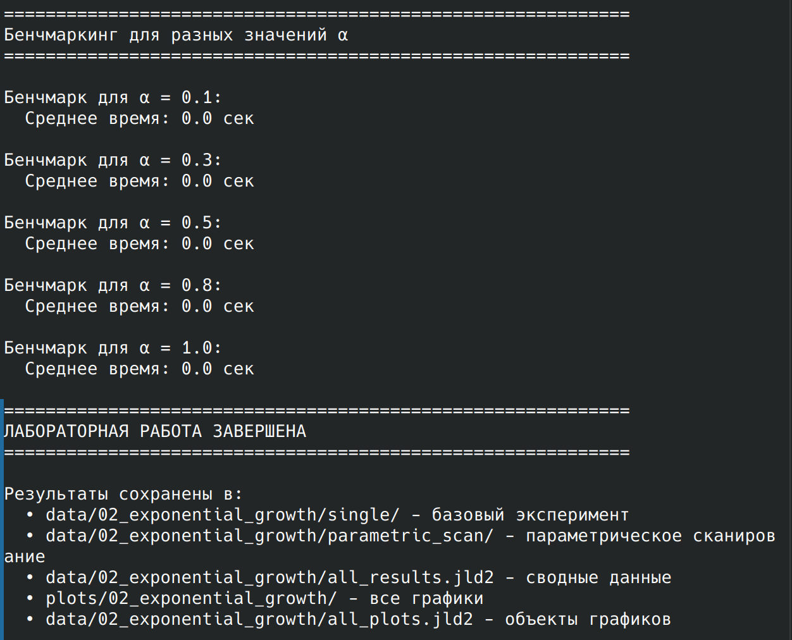

# Выводы

В ходе выполнения лабораторной работы была реализована численная модель экспоненциального роста с использованием языка программирования Julia и пакетов DifferentialEquations.jl, DrWatson.jl, Plots.jl. Проведен базовый вычислительный эксперимент при фиксированном значении скорости роста, а также параметрическое сканирование с анализом зависимости поведения системы от коэффициента α.
