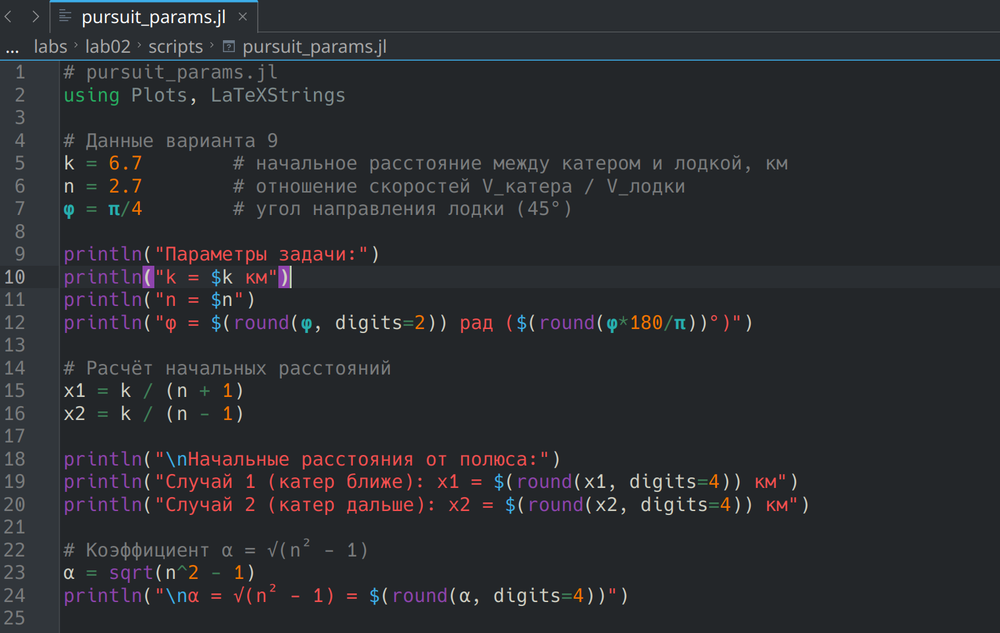
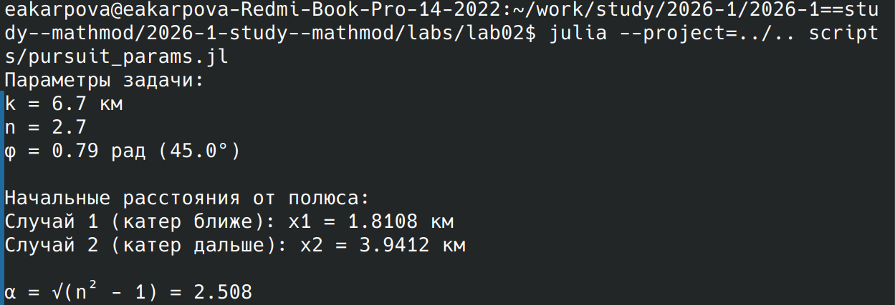
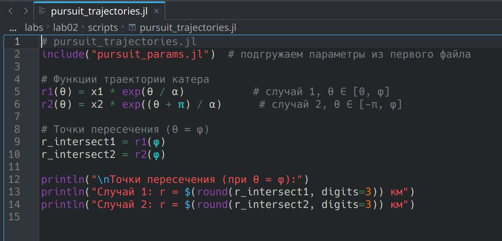
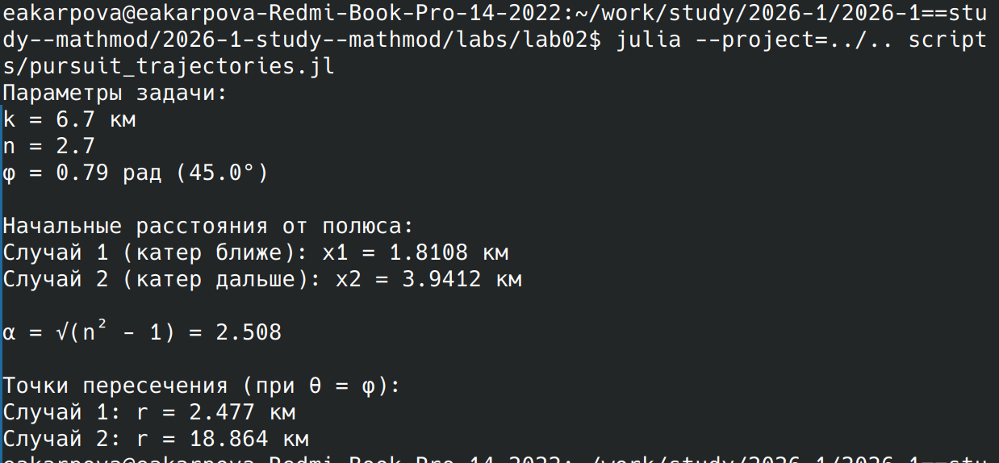
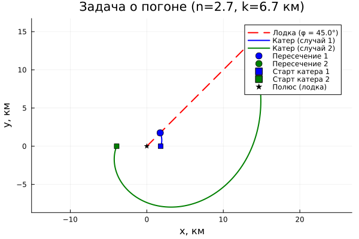
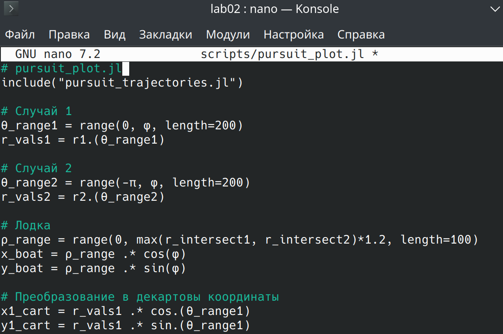
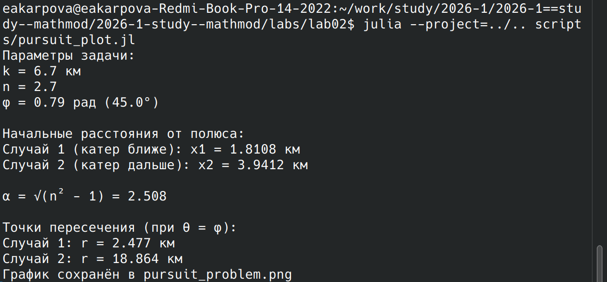

---
## Author
author:
  name: Карпова Есения Алексеевна
  degrees: DSc
  orcid: 0000-0002-0877-7063
  email: kulyabov-ds@rudn.ru
  affiliation:
    - name: Российский университет дружбы народов
      country: Российская Федерация
      postal-code: 117198
      city: Москва
      address: ул. Орджоникидзе 3
## Title
title: Лабораторная работа №2
subtitle: Математическое моделирование. Задача о погоне
license: CC BY
date: today
date-format: "YYYY-MM-DD" # Example: 2025-09-06
---

# Вводная часть

## Цель работы

Исследовать математическую модель задачи преследования (погони) на примере движения катера и лодки

## Задания

- Записать уравнение
- Построить траекторию
- Найти точку пересечения

# Выполнение лабораторной работы

## Уравнение

## Вывод уравнения

## Построение траектории

## Вывод траектории

## Траектория

## Точка пересечения

## Вывод точки пересечения

# Результаты
