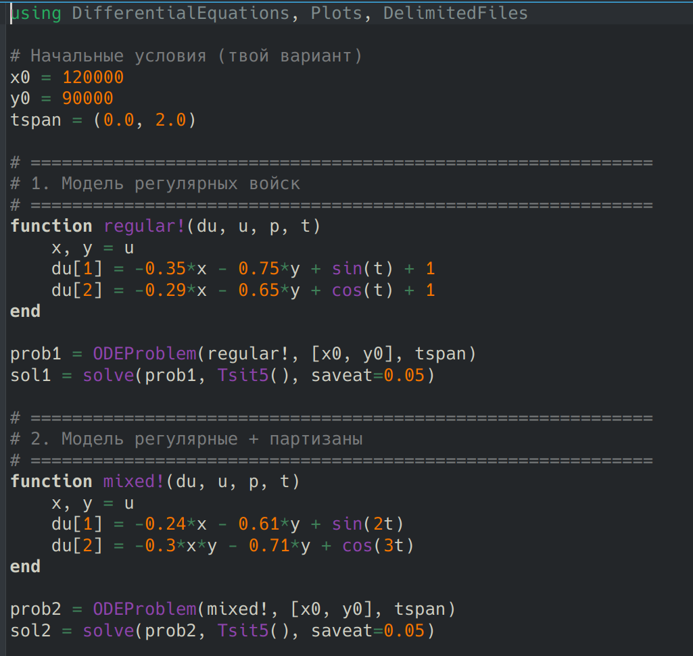
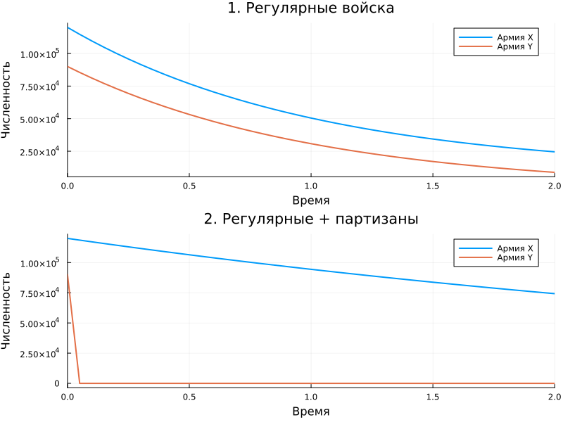

---
## Author
author:
  name: Карпова Есения Алексеевна
  degrees: DSc
  orcid: 0000-0002-0877-7063
  email: kulyabov-ds@rudn.ru
  affiliation:
    - name: Российский университет дружбы народов
      country: Российская Федерация
      postal-code: 117198
      city: Москва
      address: ул. Орджоникидзе 3
## Title
title: Лабораторная работа №3
subtitle: Математическое моделирование. Задача о войсках
license: CC BY
date: today
date-format: "YYYY-MM-DD" # Example: 2025-09-06
---

# Вводная часть

## Цели

Исследовать математические модели боевых действий между регулярными войсками, а также между регулярными войсками и партизанскими отрядами; определить условия победы каждой из сторон при заданных начальных параметрах.

## Задания

1. Регулярные войска

2. Регулярные + партизаны

# Лабораторная работа

## Скрипт

## Графики

# Результаты

В ходе работы были реализованы две модели боевых действий: классическая модель Ланчестера для регулярных войск и смешанная модель с участием партизан. Для каждой модели проведено численное решение, построены графики изменения численности армий X и Y во времени.
