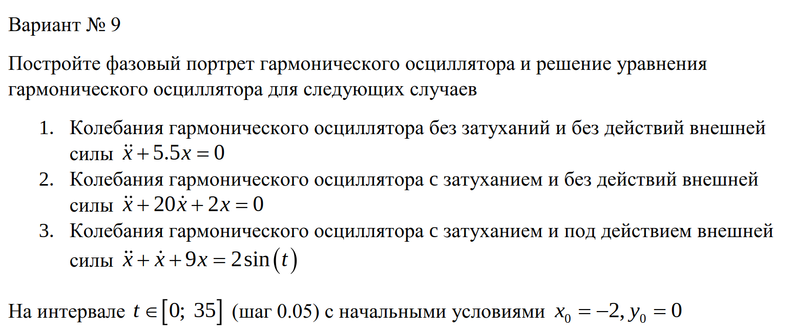
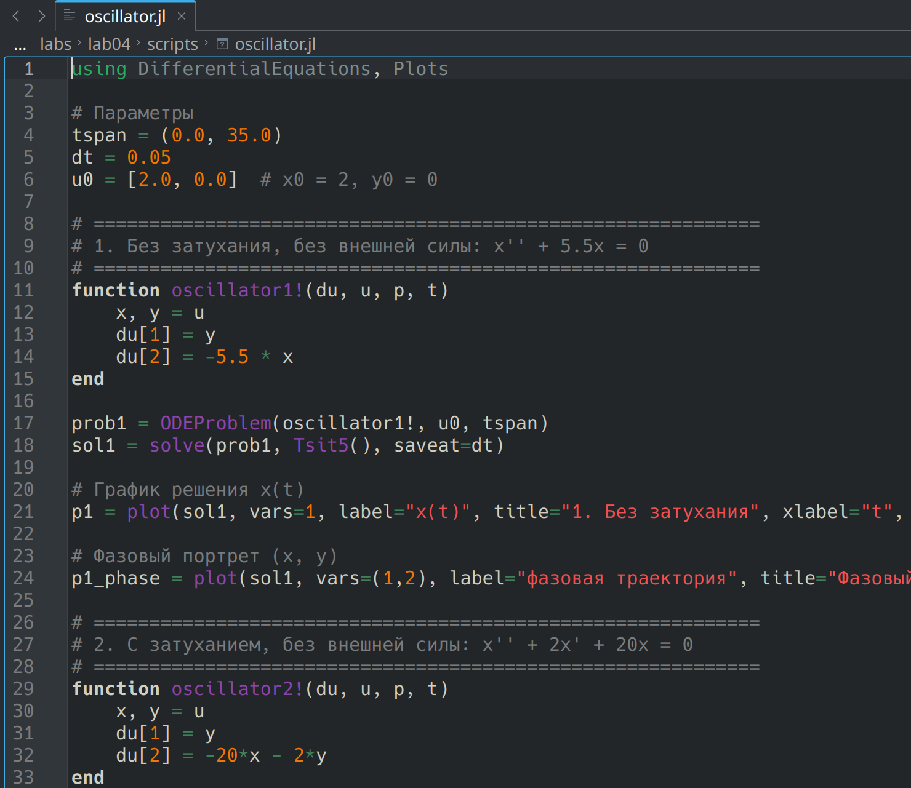

---
## Author
author:
  name: Карпова Есения Алексеевна
  degrees: DSc
  orcid: 0000-0002-0877-7063
  email: kulyabov-ds@rudn.ru
  affiliation:
    - name: Российский университет дружбы народов
      country: Российская Федерация
      postal-code: 117198
      city: Москва
      address: ул. Орджоникидзе 3
## Title
title: Лабораторная работа №4
subtitle: Математическое моделирование. Модель гармонического осциллятора
license: CC BY
date: today
date-format: "YYYY-MM-DD" # Example: 2025-09-06
---

# Вводная часть

# Цель работы

Исследовать модель гармонического осциллятора в трёх случаях: без затухания, с затуханием и с внешней силой. Построить решения и фазовые портреты для каждого случая.

# Задание

Для варианта 9 построить фазовый портрет гармонического осциллятора и решение уравнения для следующих случаев:

1. **Без затухания и без внешней силы:**
   $\ddot{x} + 5.5x = 0$

2. **С затуханием и без внешней силы:**
   $\ddot{x} + 2\dot{x} + 20x = 0$

3. **С затуханием и под действием внешней силы:**
   $\ddot{x} + \dot{x} + 9x = 2\sin t$

# Лабораторная работа

## Задание

## Скрипт

## Графики

# Результаты

- Без затухания → энергия сохраняется, фазовый портрет — эллипс

- С затуханием → колебания затухают, фазовый портрет — спираль

- С внешней силой → устанавливаются вынужденные колебания, предельный цикл
