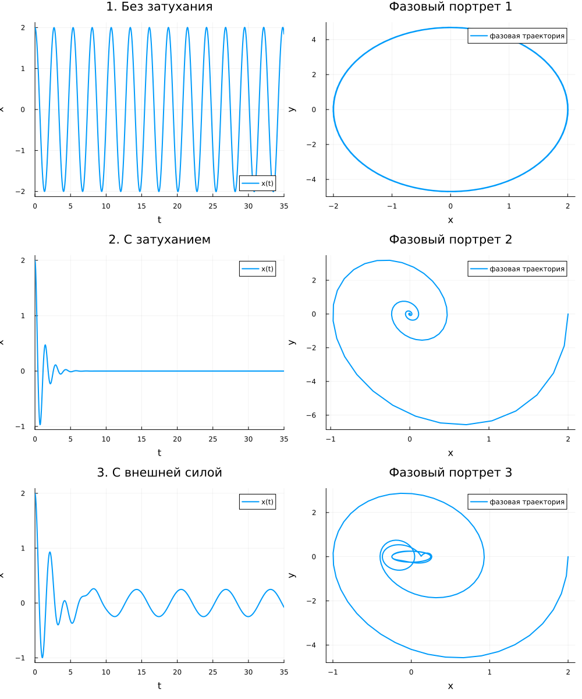

# Цель работы

Исследовать модель гармонического осциллятора в трёх случаях: без затухания, с затуханием и с внешней силой. Построить решения и фазовые портреты для каждого случая.

# Задание

Для варианта 9 построить фазовый портрет гармонического осциллятора и решение уравнения для следующих случаев:

1. **Без затухания и без внешней силы:**
   $\ddot{x} + 5.5x = 0$

2. **С затуханием и без внешней силы:**
   $\ddot{x} + 2\dot{x} + 20x = 0$

3. **С затуханием и под действием внешней силы:**
   $\ddot{x} + \dot{x} + 9x = 2\sin t$

Начальные условия: $x_0 = 2$, $\dot{x}_0 = 0$
Интервал времени: $t \in [0, 35]$, шаг $0.05$

# Теоретическое введение

## Модель гармонического осциллятора

Гармонический осциллятор — это система, совершающая колебания около положения равновесия. Уравнение свободных колебаний имеет вид:

$$
\ddot{x} + 2\gamma\dot{x} + \omega_0^2 x = 0
$$

где:
- $x$ — отклонение от положения равновесия
- $\gamma$ — коэффициент затухания (потери энергии)
- $\omega_0$ — собственная частота колебаний

При отсутствии затухания ($\gamma = 0$) получаем уравнение консервативного осциллятора:

$$
\ddot{x} + \omega_0^2 x = 0
$$

## Фазовый портрет

Фазовый портрет — это множество фазовых траекторий на фазовой плоскости $(x, \dot{x})$. Каждая точка на фазовой плоскости соответствует состоянию системы в определённый момент времени. Движение системы изображается кривой — фазовой траекторией.

# Ход работы

## Приведение к системе первого порядка

Уравнение второго порядка $\ddot{x} + 2\gamma\dot{x} + \omega_0^2 x = F(t)$ заменой $y = \dot{x}$ приводится к системе:

$$
\begin{cases}
\dot{x} = y \\
\dot{y} = -2\gamma y - \omega_0^2 x + F(t)
\end{cases}
$$

## 1. Колебания без затухания

Уравнение: $\ddot{x} + 5.5x = 0$

Система:
$$
\begin{cases}
\dot{x} = y \\
\dot{y} = -5.5x
\end{cases}
$$

Характеристики:
- Собственная частота: $\omega_0 = \sqrt{5.5} \approx 2.345$
- Период: $T = \frac{2\pi}{\omega_0} \approx 2.68$

## 2. Колебания с затуханием

Уравнение: $\ddot{x} + 2\dot{x} + 20x = 0$

Система:
$$
\begin{cases}
\dot{x} = y \\
\dot{y} = -20x - 2y
\end{cases}
$$

Характеристики:
- Собственная частота: $\omega_0 = \sqrt{20} \approx 4.472$
- Коэффициент затухания: $\gamma = 1$
- Тип колебаний: затухающие

## 3. Колебания с затуханием и внешней силой

Уравнение: $\ddot{x} + \dot{x} + 9x = 2\sin t$

Система:
$$
\begin{cases}
\dot{x} = y \\
\dot{y} = -9x - y + 2\sin t
\end{cases}
$$

# Результаты

**Анализ полученных результатов:**

1. **Без затухания** — наблюдаются незатухающие гармонические колебания с постоянной амплитудой. Фазовый портрет представляет собой эллипс (окружность в соответствующем масштабе), что соответствует сохранению энергии.

2. **С затуханием** — колебания затухают со временем, амплитуда экспоненциально убывает. Фазовый портрет — скручивающаяся спираль, стремящаяся к началу координат (положению равновесия).

3. **С внешней силой** — устанавливаются вынужденные колебания с частотой внешней силы. Фазовый портрет — замкнутая кривая (предельный цикл), соответствующая установившемуся режиму.

# Ответы на вопросы

## 1. Простейшая модель гармонических колебаний

$$\ddot{x} + \omega_0^2 x = 0$$

## 2. Определение осциллятора

**Осциллятор** — это физическая система, совершающая колебания около положения устойчивого равновесия. Примерами являются: груз на пружине, математический маятник, колебательный контур.

## 3. Модель математического маятника

Для малых колебаний:
$$\ddot{\theta} + \frac{g}{l}\theta = 0$$

Полная модель:
$$\ddot{\theta} + \frac{g}{l}\sin\theta = 0$$

## 4. Алгоритм перехода от уравнения второго порядка к системе двух уравнений первого порядка

1. Вводится новая переменная $y = \dot{x}$
2. Тогда $\dot{y} = \ddot{x}$
3. Исходное уравнение $\ddot{x} = f(x, \dot{x}, t)$ заменяется на систему:
   $$
   \begin{cases}
   \dot{x} = y \\
   \dot{y} = f(x, y, t)
   \end{cases}
   $$

## 5. Фазовый портрет и фазовая траектория

**Фазовый портрет** — это совокупность фазовых траекторий на фазовой плоскости $(x, \dot{x})$, дающая полное представление о поведении системы при различных начальных условиях.

**Фазовая траектория** — кривая в фазовом пространстве, описывающая эволюцию системы из конкретного начального состояния. Каждая точка на фазовой траектории соответствует состоянию системы в определённый момент времени.

# Вывод

В ходе работы были исследованы три режима колебаний гармонического осциллятора:

- **Без затухания** — система совершает незатухающие гармонические колебания, фазовый портрет представляет собой эллипс.
- **С затуханием** — колебания затухают, система стремится к положению равновесия, фазовый портрет — скручивающаяся спираль.
- **С внешней силой** — устанавливаются вынужденные колебания с частотой внешнего воздействия, фазовый портрет — предельный цикл.

Полученные результаты полностью соответствуют теоретическим представлениям о поведении гармонического осциллятора в различных режимах.
