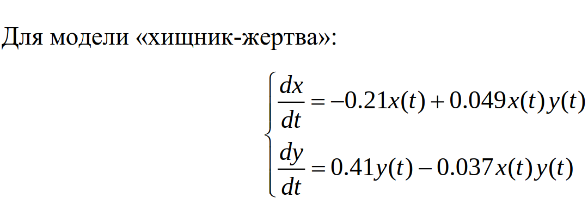
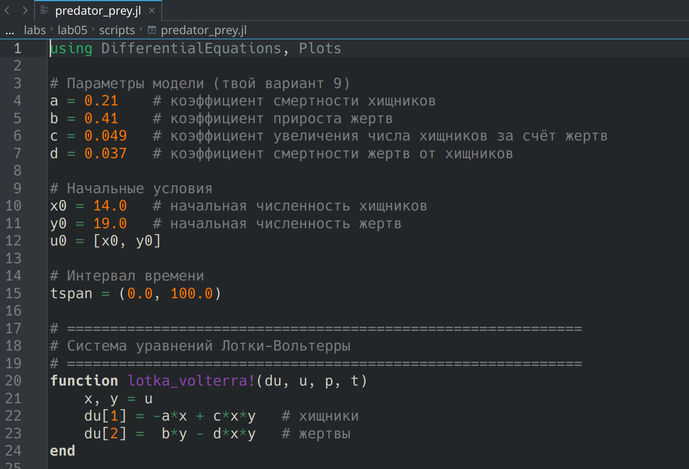
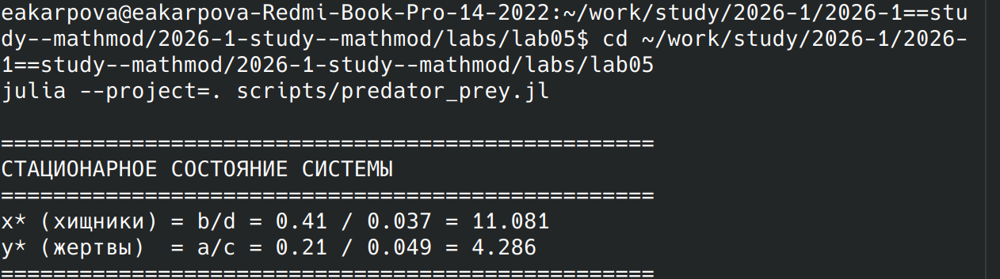

---
## Author
author:
  name: Карпова Есения Алексеевна
  degrees: DSc
  orcid: 0000-0002-0877-7063
  email: kulyabov-ds@rudn.ru
  affiliation:
    - name: Российский университет дружбы народов
      country: Российская Федерация
      postal-code: 117198
      city: Москва
      address: ул. Орджоникидзе 3
## Title
title: Лабораторная работа №5
subtitle: Математическое моделирование. Модель "хищник-жертва"
license: CC BY
date: today
date-format: "YYYY-MM-DD" # Example: 2025-09-06
---

# Вводная часть

## Цель и задачи

- Исследовать модель Лотки-Вольтерры

- Построить графики изменения численности популяций

- Найти стационарное состояние системы

# Лабораторная работа

## Задание

## Скрипт

## Вывод

## Графики

# Результаты

Модель Лотки-Вольтерры демонстрирует устойчивый циклический режим
