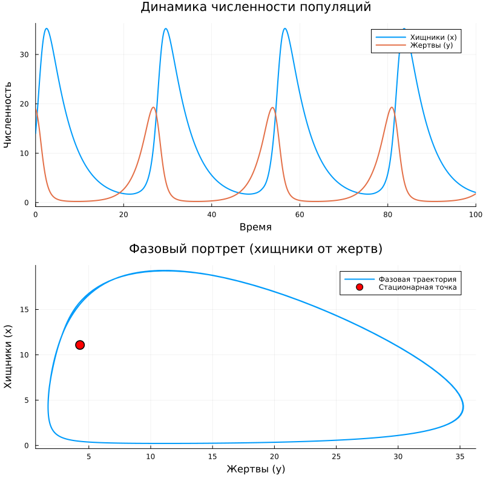

# Цель работы

Исследовать модель Лотки-Вольтерры «хищник-жертва», описывающую взаимодействие двух биологических видов. Построить фазовый портрет системы и графики изменения численности популяций во времени, найти стационарное состояние системы.

# Задание

Для модели «хищник-жертва»:

$$
\begin{cases}
\dfrac{dx}{dt} = -0.21\,x + 0.049\,x\,y \\[1em]
\dfrac{dy}{dt} = 0.41\,y - 0.037\,x\,y
\end{cases}
$$

где:
- $x$ — численность хищников,
- $y$ — численность жертв,

построить:
1. График зависимости численности хищников от численности жертв (фазовый портрет);
2. Графики изменения численности хищников $x(t)$ и жертв $y(t)$ во времени.

Начальные условия: $x_0 = 14$, $y_0 = 19$.

Найти стационарное состояние системы.

# Теоретическое введение

## Модель Лотки-Вольтерры

Модель Лотки-Вольтерры описывает динамику взаимодействия двух видов: хищников и жертв. Система уравнений имеет вид:

$$
\begin{cases}
\dfrac{dx}{dt} = -a x + c x y \\[1em]
\dfrac{dy}{dt} = b y - d x y
\end{cases}
$$

где:
- $a$ — коэффициент естественной смертности хищников,
- $b$ — коэффициент естественного прироста жертв,
- $c$ — коэффициент увеличения числа хищников за счёт потребления жертв,
- $d$ — коэффициент смертности жертв от хищников.

## Стационарное состояние

Система имеет нетривиальное стационарное состояние (положение равновесия), которое находится из условий $\frac{dx}{dt} = 0$, $\frac{dy}{dt} = 0$:

$$
x^* = \frac{b}{d}, \quad y^* = \frac{a}{c}
$$

В этой точке численности популяций не изменяются во времени.

## Фазовый портрет

Фазовый портрет системы — это кривая на плоскости $(y, x)$, показывающая зависимость численности хищников от численности жертв. В модели Лотки-Вольтерры фазовые траектории представляют собой замкнутые кривые вокруг стационарной точки, что соответствует периодическим колебаниям численности обоих видов.

# Ход работы

## Параметры модели (вариант 9)

- $a = 0.21$ — коэффициент смертности хищников
- $b = 0.41$ — коэффициент прироста жертв
- $c = 0.049$ — коэффициент увеличения хищников за счёт жертв
- $d = 0.037$ — коэффициент смертности жертв от хищников

Начальные условия:
- $x_0 = 14$ (начальная численность хищников)
- $y_0 = 19$ (начальная численность жертв)

Интервал моделирования: $t \in [0, 100]$

## Численное решение

Для численного решения системы дифференциальных уравнений использовался язык Julia и пакет DifferentialEquations.jl. Система была приведена к виду, удобному для решения:

```julia
function lotka_volterra!(du, u, p, t)
    x, y = u
    du[1] = -a*x + c*x*y   # хищники
    du[2] =  b*y - d*x*y   # жертвы
end
```

Решение получено с помощью метода Tsit5 (метод Рунге-Кутты 5-го порядка) с сохранением результатов с шагом 0.1.

## Стационарное состояние

Стационарное состояние системы вычисляется по формулам:

$$
x^* = \frac{b}{d} = \frac{0.41}{0.037} \approx 11.081
$$
$$
y^* = \frac{a}{c} = \frac{0.21}{0.049} \approx 4.286
$$

# Результаты



*Рисунок 1 — Динамика численности популяций (слева) и фазовый портрет системы (справа)*

## Анализ полученных результатов

### График изменения численности во времени (левый график)

На графике $x(t)$ и $y(t)$ наблюдаются периодические колебания численности обоих видов. Характерные особенности:

- Колебания происходят **в противофазе**: когда численность жертв растёт, численность хищников начинает увеличиваться с задержкой;
- После достижения пика численности хищников популяция жертв начинает сокращаться из-за интенсивного выедания;
- Уменьшение численности жертв приводит к нехватке пищи для хищников, и их численность также начинает падать;
- Когда хищников становится мало, популяция жертв восстанавливается, и цикл повторяется.

### Фазовый портрет (правый график)

На фазовом портрете изображена зависимость $x(y)$ — численности хищников от численности жертв. Наблюдаемые особенности:

- Фазовая траектория представляет собой **замкнутую кривую** (цикл), что соответствует периодическому режиму;
- Красной точкой отмечено **стационарное состояние** системы $(y^*, x^*) \approx (4.286, 11.081)$;
- Траектория вращается вокруг стационарной точки, не приближаясь к ней и не удаляясь — это характерно для классической модели Лотки-Вольтерры;
- Направление движения по фазовой траектории — по часовой стрелке (при увеличении численности жертв хищники сначала растут, затем падают и т.д.).

# Ответы на вопросы

## 1. Стационарное состояние системы

Стационарное состояние (положение равновесия) находится из условий $\frac{dx}{dt} = 0$ и $\frac{dy}{dt} = 0$:

$$
\begin{cases}
-a x + c x y = 0 \\
b y - d x y = 0
\end{cases}
$$

Отсюда получаем:
- Из первого уравнения: $x(-a + c y) = 0$ → либо $x = 0$ (тривиальное решение), либо $y = a/c$
- Из второго уравнения: $y(b - d x) = 0$ → либо $y = 0$, либо $x = b/d$

Нетривиальное стационарное состояние:

$$
x^* = \frac{b}{d}, \quad y^* = \frac{a}{c}
$$

Для нашего варианта: $x^* \approx 11.081$, $y^* \approx 4.286$

## 2. Что такое фазовый портрет?

**Фазовый портрет** — это совокупность фазовых траекторий на фазовой плоскости $(y, x)$, дающая полное представление о поведении системы при различных начальных условиях. Каждая точка на фазовой траектории соответствует состоянию системы в определённый момент времени.

## 3. Почему колебания происходят в противофазе?

Колебания в противофазе объясняются логикой взаимодействия видов:
- Рост численности жертв → больше пищи для хищников → рост хищников
- Рост хищников → большее потребление жертв → падение численности жертв
- Падение жертв → нехватка пищи → падение хищников
- Падение хищников → восстановление жертв → цикл повторяется

Это создаёт сдвиг фаз примерно в четверть периода между пиками численности хищников и жертв.

## 4. Что произойдёт, если начальные условия совпадут со стационарной точкой?

Если задать начальные условия $x_0 = x^*$, $y_0 = y^*$, то система останется в равновесии: численности популяций не будут меняться со временем. Это состояние неустойчиво — любое малое отклонение приведёт к возникновению колебаний.

# Вывод

В ходе работы была исследована модель Лотки-Вольтерры «хищник-жертва» с параметрами варианта 9:

- $a = 0.21$, $b = 0.41$, $c = 0.049$, $d = 0.037$

**Основные результаты:**

1. **Стационарное состояние системы:**
   $x^* = b/d \approx 11.081$ (хищники), $y^* = a/c \approx 4.286$ (жертвы)

2. **Динамика численности:**
   Наблюдаются периодические колебания обеих популяций с постоянной амплитудой. Колебания происходят в противофазе, что соответствует классической модели Лотки-Вольтерры.

3. **Фазовый портрет:**
   Представляет собой замкнутую кривую (цикл) вокруг стационарной точки, что подтверждает периодический характер движения.

Полученные результаты полностью соответствуют теоретическим представлениям о поведении системы «хищник-жертва» в рамках модели Лотки-Вольтерры. Модель наглядно демонстрирует механизм саморегуляции в биологических системах за счёт обратных связей между популяциями.
