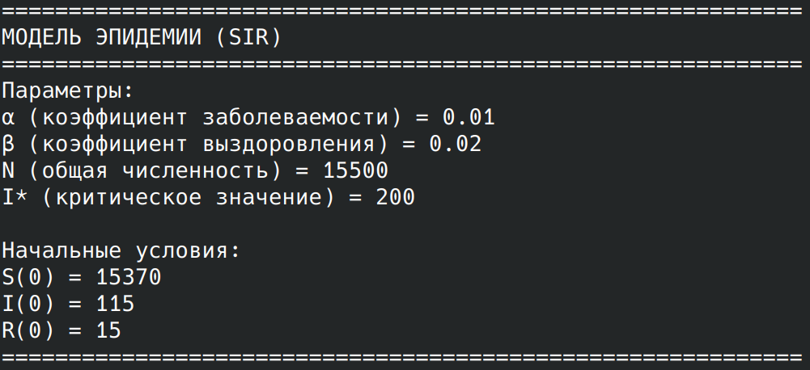
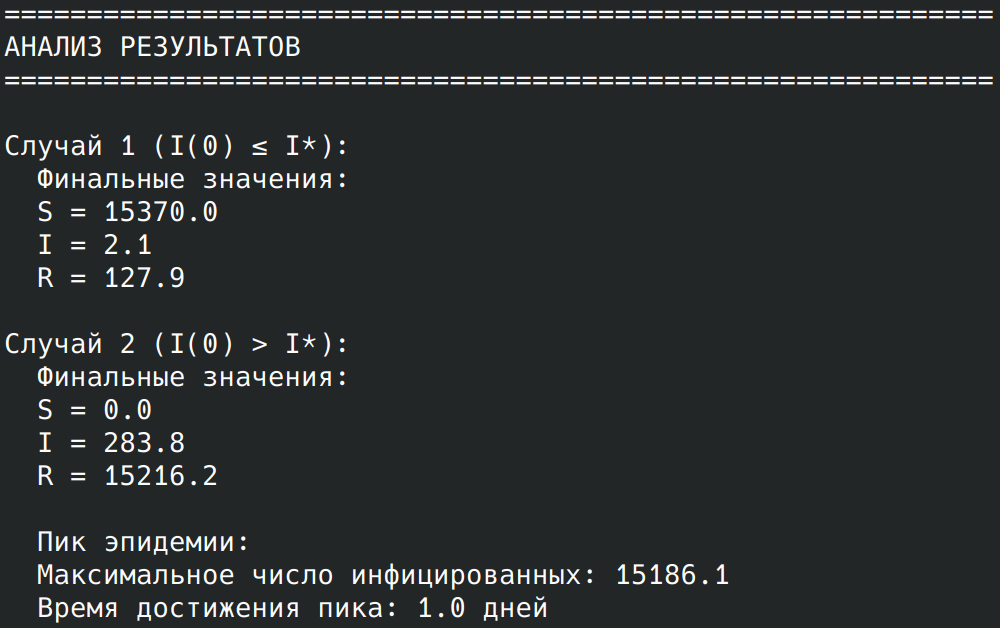
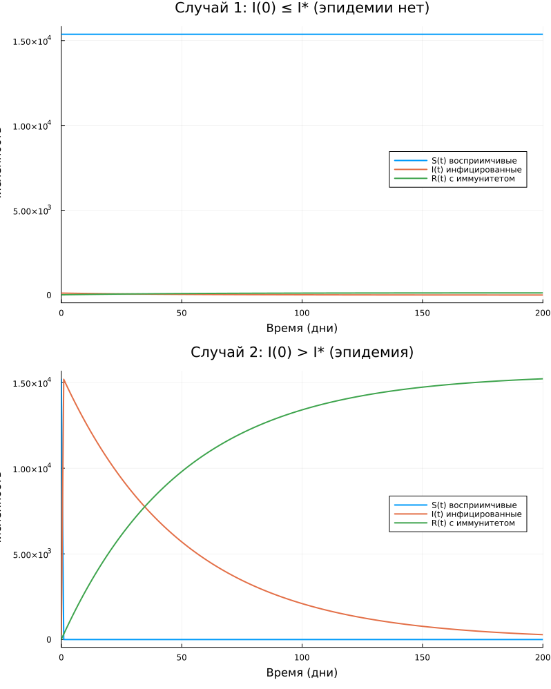

---
## Author
author:
  name: Карпова Есения Алексеевна
  degrees: DSc
  orcid: 0000-0002-0877-7063
  email: kulyabov-ds@rudn.ru
  affiliation:
    - name: Российский университет дружбы народов
      country: Российская Федерация
      postal-code: 117198
      city: Москва
      address: ул. Орджоникидзе 3
## Title
title: Лабораторная работа №6
subtitle: Математическое моделирование. Модель эпидемии (SIR)
license: CC BY
date: today
date-format: "YYYY-MM-DD" # Example: 2025-09-06
---

# Вводная часть

## Цель и задачи

- Исследовать модель распространения эпидемии
- Построить графики изменения трёх групп населения
- Рассмотреть два случая: ниже и выше критического порога

# Лабораторная работа

## Задание

## Скрипт

## Графики

# Результаты

- Модель SIR успешно реализована
- Построены графики для двух случаев
- Проведён анализ динамики эпидемии
- Показана роль критического порога
