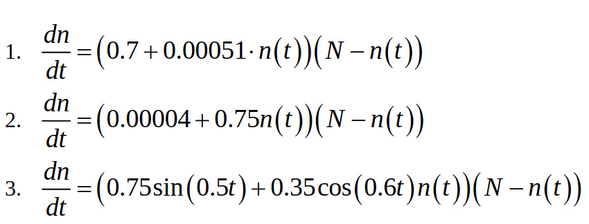
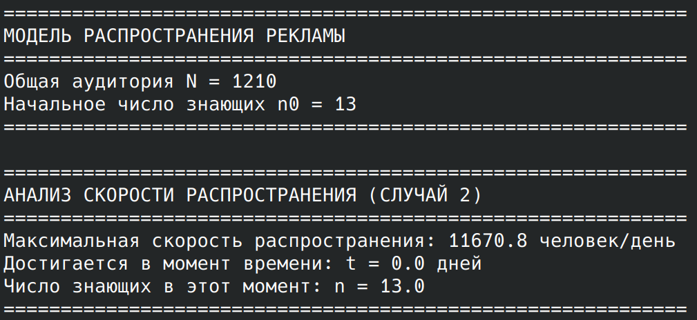

---
## Author
author:
  name: Карпова Есения Алексеевна
  degrees: DSc
  orcid: 0000-0002-0877-7063
  email: kulyabov-ds@rudn.ru
  affiliation:
    - name: Российский университет дружбы народов
      country: Российская Федерация
      postal-code: 117198
      city: Москва
      address: ул. Орджоникидзе 3
## Title
title: Лабораторная работа №7
subtitle: Математическое моделирование. Модель распространения рекламы
license: CC BY
date: today
date-format: "YYYY-MM-DD" # Example: 2025-09-06
---

# Вводная часть

## Цель и задачи

- Исследовать модель распространения рекламы
- Рассмотреть 3 случая с разными коэффициентами
- Найти момент максимальной скорости
- Сравнить эффективность стратегий

# Лабораторная работа

## Параметры задачи

- Общая аудитория: N = 1210 человек
- Начало: n₀ = 13 человек знают

## Уравнения

## Модель

## Графики

# Выводы

Прямая реклама = быстрый старт
Сарафанное радио = взрывной рост
Пик скорости на 11 день
Вся аудитория охвачена к 30 дню
