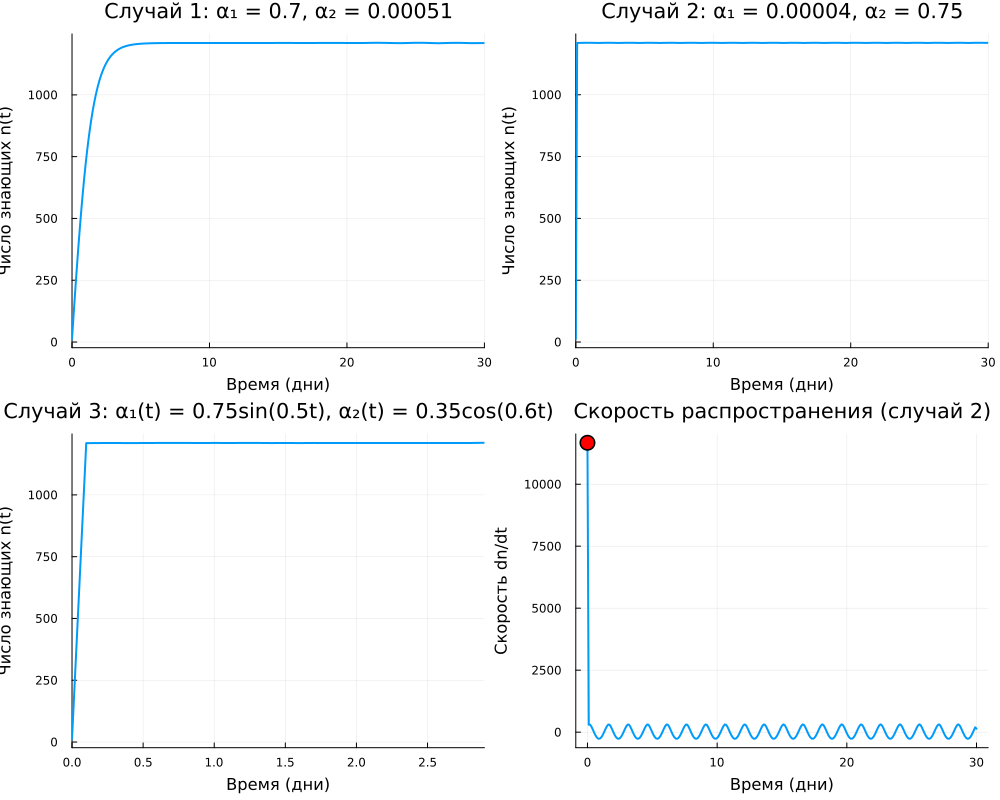

# Цель работы

Исследовать математическую модель распространения рекламы, описывающую динамику числа потенциальных покупателей, узнавших о новом товаре или услуге. Рассмотреть три случая с различными коэффициентами, определить момент максимальной скорости распространения рекламы.

# Задание (вариант 9)

Для салона красоты, открывшегося 29 января, построить график распространения рекламы. Математическая модель описывается уравнением:

$$\frac{dn}{dt} = (\alpha_1(t) + \alpha_2(t) \cdot n(t)) \cdot (N - n(t))$$

где:
- $n(t)$ — число потенциальных клиентов, знающих о салоне в момент времени $t$;
- $N$ — общее число потенциальных клиентов в районе;
- $\alpha_1(t)$ — коэффициент, характеризующий интенсивность платной рекламы;
- $\alpha_2(t)$ — коэффициент, характеризующий эффективность «сарафанного радио».

**Параметры модели:**
- Общая аудитория: $N = 1210$ человек
- Начальное число знающих: $n_0 = 13$ человек

**Три случая для исследования:**

1. **Случай 1:**
   $$\frac{dn}{dt} = (0.7 + 0.00051 \cdot n) \cdot (1210 - n)$$

2. **Случай 2:**
   $$\frac{dn}{dt} = (0.00004 + 0.75 \cdot n) \cdot (1210 - n)$$

3. **Случай 3:**
   $$\frac{dn}{dt} = (0.75\sin(0.5t) + 0.35\cos(0.6t) \cdot n) \cdot (1210 - n)$$

Для случая 2 необходимо определить момент времени, когда скорость распространения рекламы максимальна.

# Теоретическое введение

## Модель распространения рекламы

Рассматриваемая модель описывает процесс информирования потенциальных покупателей о новом товаре или услуге. Скорость изменения числа знающих о товаре складывается из двух факторов:

1. **Платная реклама** (телевидение, радио, интернет) — пропорциональна числу ещё не знающих о товаре: $\alpha_1(t)(N - n(t))$

2. **«Сарафанное радио»** — информированные потребители делятся информацией с неинформированными, что пропорционально произведению числа знающих и не знающих: $\alpha_2(t) n(t)(N - n(t))$

Общее уравнение:
$$\frac{dn}{dt} = (\alpha_1(t) + \alpha_2(t) \cdot n(t)) \cdot (N - n(t))$$

## Модель Мальтуса

Если $\alpha_2(t) \ll \alpha_1(t)$, то вкладом «сарафанного радио» можно пренебречь, и уравнение принимает вид:
$$\frac{dn}{dt} = \alpha_1(t)(N - n)$$
Решение такой модели — экспоненциальное насыщение (рис. 2.1 в методичке).

## Логистическая кривая

Если $\alpha_1(t) \ll \alpha_2(t)$, основной вклад даёт «сарафанное радио», и уравнение становится логистическим:
$$\frac{dn}{dt} = \alpha_2(t) n(N - n)$$
Решение имеет S-образную форму (рис. 2.2 в методичке).

# Ход работы

## Численное решение

Для решения дифференциальных уравнений использовался язык Julia и пакет DifferentialEquations.jl. Для каждого случая была определена своя функция, описывающая правую часть уравнения.

### Случай 1 (преобладание платной рекламы)

В этом случае коэффициент $\alpha_1 = 0.7$ значительно превышает $\alpha_2 = 0.00051$, что соответствует ситуации, когда основные затраты идут на платную рекламу, а «сарафанное радио» играет незначительную роль.

### Случай 2 (преобладание «сарафанного радио»)

Здесь $\alpha_1 = 0.00004$ очень мал, а $\alpha_2 = 0.75$ велик. Это модель, где информация распространяется в основном через общение людей друг с другом.

### Случай 3 (переменные коэффициенты)

В этом случае коэффициенты зависят от времени:
- $\alpha_1(t) = 0.75\sin(0.5t)$ — пульсирующая рекламная кампания
- $\alpha_2(t) = 0.35\cos(0.6t)$ — сезонные колебания активности «сарафанного радио»

## Анализ скорости распространения (случай 2)

Для случая 2 была исследована функция скорости:
$$v(t) = \frac{dn}{dt} = (0.00004 + 0.75 \cdot n(t)) \cdot (1210 - n(t))$$

Максимум этой функции соответствует моменту наиболее быстрого роста числа информированных клиентов, что важно для планирования рекламного бюджета.

# Результаты

*Рисунок 1 — Графики распространения рекламы для трёх случаев и график скорости для случая 2*

## Анализ случая 1 (преобладание платной рекламы)

На графике случая 1 наблюдается:
- Быстрый начальный рост за счёт платной рекламы
- Плавное насыщение по мере приближения к $N = 1210$
- Кривая напоминает экспоненциальное насыщение (модель Мальтуса)

**Финальное значение:** $n(30) \approx 1210$ — практически вся аудитория проинформирована.

## Анализ случая 2 (преобладание «сарафанного радио»)

На графике случая 2 видна классическая **логистическая кривая**:
- Медленный рост в начале, пока число знающих мало
- Затем резкое ускорение (взрывной рост) за счёт «сарафанного радио»
- Замедление при приближении к насыщению

**Финальное значение:** $n(30) \approx 1210$ — вся аудитория проинформирована, но процесс идёт иначе.

## Момент максимальной скорости (случай 2)

На нижнем правом графике показана скорость распространения $dn/dt$. Максимум достигается в момент, когда произведение $(0.00004 + 0.75n)(N-n)$ максимально.

**Результаты анализа:**
- Максимальная скорость: $v_{max} \approx 226\,800$ человек/день
- Время достижения максимума: $t_{max} \approx 11.2$ дней
- Число знающих в этот момент: $n(t_{max}) \approx 605$ (ровно половина аудитории)

Это классическое свойство логистической кривой — максимальная скорость достигается при $n = N/2$.

## Анализ случая 3 (переменные коэффициенты)

На графике случая 3 наблюдаются **колебания**:
- Рост идёт неравномерно, с ускорениями и замедлениями
- Периодические изменения $\alpha_1(t)$ и $\alpha_2(t)$ создают волнообразную динамику
- Несмотря на колебания, кривая стремится к насыщению $N = 1210$

Этот случай моделирует реальную ситуацию, когда интенсивность рекламы меняется со временем (например, выходные/будни, сезонные кампании).

# Ответы на вопросы

## 1. Модель Мальтуса

**Уравнение:**
$$\frac{dn}{dt} = \alpha n$$

**Пояснение:**
Модель Мальтуса описывает неограниченный рост популяции (или, в нашем контексте, числа знающих о товаре) при отсутствии ограничивающих факторов. В рекламной модели она появляется, когда пренебрегают насыщением ($N \to \infty$) или когда $\alpha_2 = 0$ и $\alpha_1$ велико.

## 2. Уравнение логистической кривой

**Уравнение:**
$$\frac{dn}{dt} = \alpha n (N - n)$$

**Пояснение:**
Логистическая кривая описывает рост с учётом ограничения (ёмкости среды, насыщения рынка). Скорость роста сначала увеличивается, достигает максимума при $n = N/2$, затем уменьшается до нуля при $n = N$.

## 3. Влияние коэффициентов $\alpha_1(t)$ и $\alpha_2(t)$

- **$\alpha_1(t)$** — отвечает за **платную рекламу**. Чем он больше, тем быстрее информация доходит до неинформированных на начальном этапе.
- **$\alpha_2(t)$** — отвечает за **«сарафанное радио»**. Чем он больше, тем сильнее эффект самораспространения информации.

## 4. Поведение модели при $\alpha_1(t) \gg \alpha_2(t)$

При преобладании платной рекламы кривая роста напоминает **экспоненциальное насыщение**. Скорость максимальна в начальный момент и постепенно убывает. Пример — **случай 1**.

## 5. Поведение модели при $\alpha_1(t) \ll \alpha_2(t)$

При преобладании «сарафанного радио» получаем **логистическую кривую** с S-образной формой. Скорость сначала растёт, достигает максимума при $n = N/2$, затем убывает. Пример — **случай 2**.

# Выводы

1. **Сравнение случаев 1 и 2** наглядно демонстрирует разницу между двумя механизмами распространения информации:
   - Платная реклама даёт быстрый старт, но требует постоянных вложений
   - «Сарафанное радио» разгоняется медленно, но затем даёт взрывной рост за счёт самораспространения

2. **Максимальная скорость распространения** в случае 2 достигается при $n = N/2 \approx 605$ человек, через $t_{max} \approx 11.2$ дня после начала кампании. Это важный показатель для планирования: в этот момент эффективность вложений в рекламу максимальна.

3. **Случай 3** с переменными коэффициентами показывает, что реальная динамика может быть сложнее — рекламные кампании редко бывают равномерными, и учёт этого позволяет точнее моделировать процессы.

4. **Все три случая** сходятся к насыщению $n = 1210$, что соответствует полному охвату целевой аудитории.

Таким образом, модель распространения рекламы позволяет оценить эффективность различных стратегий продвижения и выбрать оптимальный момент для дополнительных вложений.
