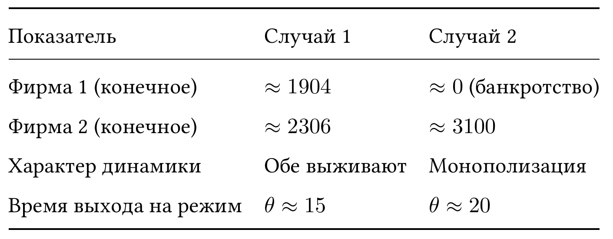
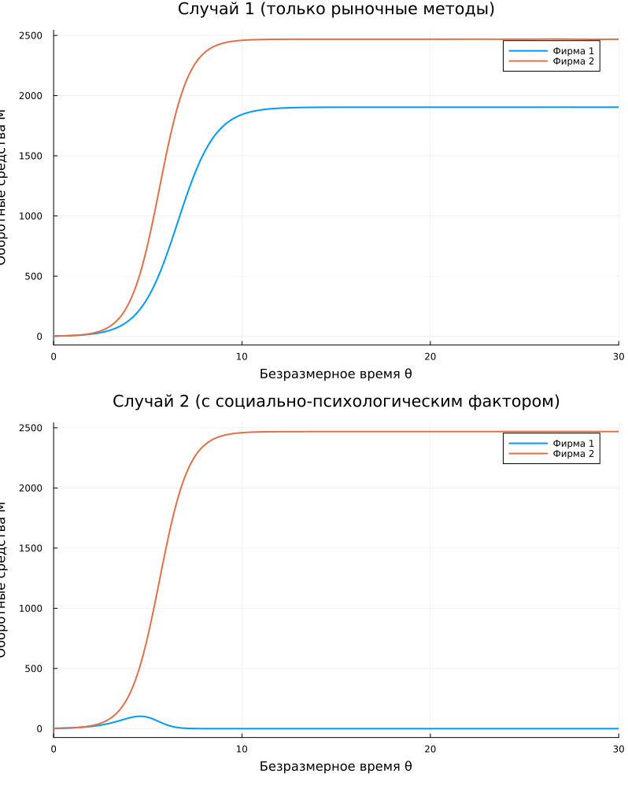

---
## Author
author:
  name: Карпова Есения Алексеевна
  degrees: DSc
  orcid: 0000-0002-0877-7063
  email: kulyabov-ds@rudn.ru
  affiliation:
    - name: Российский университет дружбы народов
      country: Российская Федерация
      postal-code: 117198
      city: Москва
      address: ул. Орджоникидзе 3
## Title
title: Лабораторная работа №8
subtitle: Математическое моделирование. Модель конкуренции двух фирм
license: CC BY
date: today
date-format: "YYYY-MM-DD" # Example: 2025-09-06
---

# Вводная часть

## Цель и задачи

Исследовать модель конкуренции двух фирм

Сравнить два случая: рыночные методы и социально-психологические факторы

Построить графики оборотных средств

Найти стационарное состояние

# Лабораторная работа

## Параметры задачи

Рыночные методы

С социально-психологическим фактором

## Анализ

## Графики

# Выводы

Модель реализована численно в Julia

Построены графики для двух случаев

Найдено стационарное состояние

Проведён анализ и сравнение

Показано влияние социально-психологических факторов на конкуренцию
