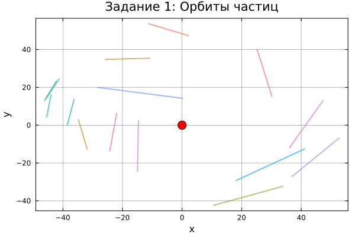
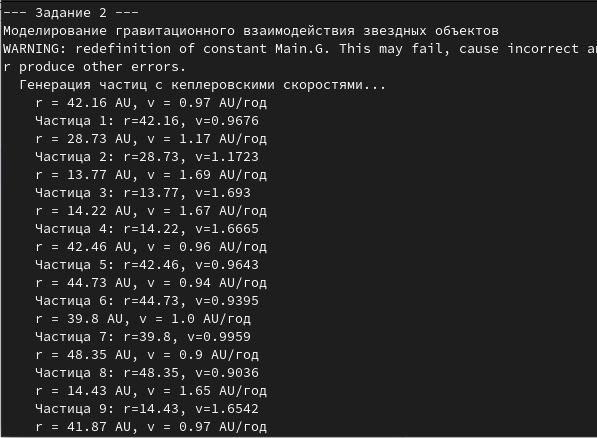
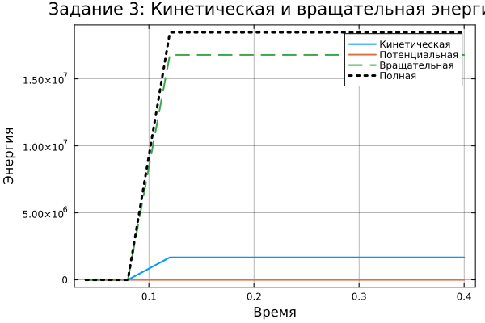
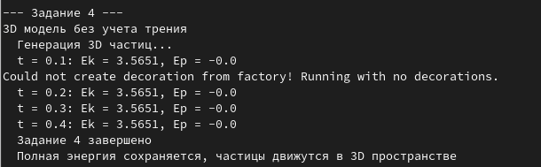
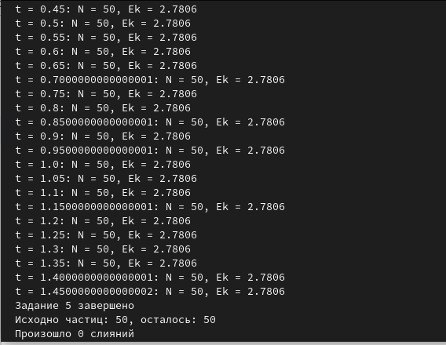
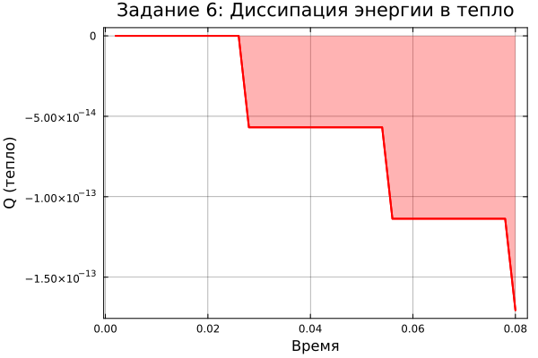
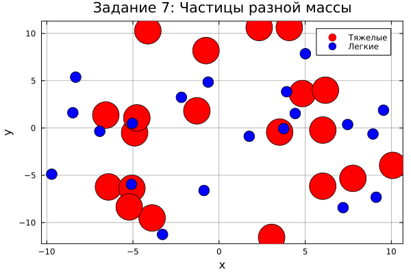

---
author:
  - name: Арбатова Варвара Петровна
    degrees: BSc
    orcid: 0000-0002-0877-7063
    email: 1132236020@rudn.ru
    affiliation:
      name: Российский университет дружбы народов
      country: Российская Федерация
      postal-code: 117198
      city: Москва
      address: ул. Оржоникидзе, 3
  - name: Карпова Есения Алексеевна
    degrees: BSc
    email: 1132236008@rudn.ru
    affiliation:
      name: Российский университет дружбы народов
      country: Российская Федерация
      postal-code: 117198
      city: Москва
      address: ул. Оржоникидзе, 3
  - name: Дагделен Зейнап Реджеповна
    degrees: BSc
    email: 1132236052@rudn.ru
    affiliation:
      name: Российский университет дружбы народов
      country: Российская Федерация
      postal-code: 117198
      city: Москва
      address: ул. Оржоникидзе, 3
  - name: Бюгданюк Анна Васильевна
    degrees: BSc
    email: 1132236023@rudn.ru
    affiliation:
      name: Российский университет дружбы народов
      country: Российская Федерация
      postal-code: 117198
      city: Москва
      address: ул. Оржоникидзе, 3
  - name: Люпп Софья Романовна
    degrees: BSc
    email: 1132236039@rudn.ru
    affiliation:
      name: Российский университет дружбы народов
      country: Российская Федерация
      postal-code: 117198
      city: Москва
      address: ул. Оржоникидзе, 3
title: "Проектная работа. Образование планетной системы"
subtitle: "Защита проекта. Коллективное обсуждение результата проекта, самооценка деятельности"
license: "CC BY"
---

# Цель защитного доклада

Подвести итог выполненной проектной работы, обобщить теоретические, алгоритмические и программные результаты, провести коллективное обсуждение достигнутого, оценить вклад каждого участника и определить перспективы развития модели.

# Что сделано в рамках проектной работы

В ходе проекта была решена задача численного моделирования образования планетной системы из газопылевого облака. Работа охватила полный цикл: от физической постановки до программной реализации и анализа результатов. Ниже перечислены основные выполненные этапы.

## Теоретическое исследование

Изучены современные представления о происхождении звёзд и планетных систем (модель Большого взрыва, гравитационная неустойчивость, теория Отто Шмидта).
Выведены и обоснованы математические соотношения:

- Гравитационный потенциал системы частиц;
- Начальные условия для равномерного распределения в диске с кеплеровскими скоростями;
- Силы отталкивания при контакте (закон степени 8);
- Силы трения, зависящие от относительной тангенциальной скорости;
- Уравнения вращения частиц и момент инерции;
- Условие слипания с сохранением массы, импульса и вычислением радиуса новой частицы.

Описаны постепенные усложнения модели: 2D → 3D, введение взаимодействий, вращения, трения, слипания, разнородных частиц и случайных масс.

## Разработка алгоритмов

Спроектированы структуры данных для хранения состояния частиц (масса, радиус, координаты, скорость, угловая скорость, флаг активности), реализован алгоритм инициализации, обеспечивающий нулевой суммарный импульс системы, разработан главный цикл моделирования, включающий:

- Вычисление всех парных сил (гравитация всегда, отталкивание и трение только при контакте);
- Интегрирование уравнений движения методом Верле (скоростная форма, второй порядок точности);
- Ибновление угловых скоростей на основе моментов сил трения;
- Ироверку условия слипания и объединения частиц;
- Расчёт кинетической (поступательной и вращательной), потенциальной и полной энергии, а также энергии, перешедшей в тепло.

Также были построены подробные блок-схемы, наглядно отражающие логику работы программы.

## Программная реализация

Выбран язык Julia как оптимальный для научных вычислений.
Создана модульная структура:

- `particle.jl` – определение типа `Particle`, функции слияния, вычисления энергий, обнуления импульса;
- `forces.jl` – вычисление гравитационных сил, сил отталкивания, трения и моментов;
- `integrator.jl` – метод Верле и шаг по времени;
- `simulation.jl` – генерация начальных условий (2D/3D диски, разные массы, случайные параметры);
- `visualization.jl` – построение проекций, графиков энергий, числа частиц, траекторий, анимация;
- `main.jl` и `quickrun.jl` – запуск всех заданий.

Реализованы все 7 заданий от простого (движение в центральном поле) до сложного (трёхмерная система с разнородными частицами, трением и слипанием).
Проведены численные эксперименты, получены графики: зависимость кинетической, потенциальной, полной энергии и тепловых потерь от времени; проекции движения частиц; эволюция числа активных частиц.

## Полученные результаты и их интерпретация

**Задание 1.** В центральном поле частицы движутся по устойчивым орбитам, импульс системы успешно обнулён.

{width=50%}

**Задание 2.** Введение взаимной гравитации и отталкивания приводит к начальному гравитационному коллапсу; потенциальная энергия уменьшается, кинетическая – растёт (система разогревается).

{width=50%}

**Задание 3.** Учёт вращения добавляет вращательную компоненту кинетической энергии; отношение вращательной энергии к поступательной зависит от интенсивности трения.

{width=70%}

**Задание 4.** В 3D без трения полная энергия сохраняется (в пределах точности численного метода), проекции демонстрируют сложное нерегулярное движение.

{width=70%}

**Задание 5.** Слипание приводит к уменьшению числа частиц; образуются более массивные тела – зародыши планет. Сохраняются масса и импульс.

{width=70%}

**Задание 6.** Введение трения вызывает диссипацию механической энергии, часть переходит в тепло. Полная энергия убывает, система стремится к более компактной конфигурации.

{width=70%}

**Задание 7.** Частицы двух сортов (лёгкие и тяжёлые) демонстрируют дифференциальное слипание: тяжёлые быстрее аккрецируют лёгкие. График перехода энергии в тепло подтверждает необратимость процесса. Случайное распределение масс приближает модель к реальным протопланетным дискам.

{width=70%}

# Коллективное обсуждение результатов

В ходе совместной работы мы обсудили следующие аспекты:

**Достоинства модели:** модель учитывает основные физические механизмы – гравитацию, неупругие столкновения, трение, вращение. Метод Верле обеспечивает энергетическую стабильность. Модульная структура кода позволяет легко добавлять новые эффекты (например, газовое сопротивление, фрагментацию).

**Ограничения и допущения:** из-за сложности $O(N^2)$ мы ограничены числом частиц ~200–500; использовано упрощённое выражение для силы трения; слипание происходит мгновенно и без учёта прочности материала; отсутствуют гидродинамические эффекты и радиационный перенос энергии.

**Сложности при реализации:** численная устойчивость при близких столкновениях потребовала адаптивного выбора шага по времени; баланс между гравитацией и отталкиванием критичен для предотвращения нефизичного проникновения частиц.

**Что удалось достичь:** полностью выполнены все пункты задания, получены наглядные визуализации, программа работает стабильно. Результаты качественно согласуются с реальными процессами: из хаотического облака со временем формируются несколько крупных тел, а мелкие частицы либо слипаются, либо выбрасываются.

**Пути улучшения:** можно реализовать дерево Барнса – Хата для ускорения вычислений, добавить учёт газового диска, ввести распределение частиц по размерам, сделать анимацию в реальном времени.

# Самооценка деятельности

Каждый участник внёс конкретный вклад:

- Арбатова В.П. – руководитель группы, постановка задач, проверка теоретической части, написание выводов и оформление докладов.
- Карпова Е.А. – написание документации, подготовка блок-схем, сборка итогового доклада, презентация.
- Дагделен З.Р. – создание модуля визуализации (`visualization.jl`), построение графиков, анализ энергетических кривых.
- Бюгданюк А.В. – генерация начальных условий, реализация слипания (`particle.jl`, `simulation.jl`), выполнение заданий 4–7.
- Люпп С.Р. – разработка алгоритмов вычисления сил и интеграции, реализация `forces.jl` и `integrator.jl`, тестирование.

Все задачи, поставленные в начале проекта, выполнены в полном объёме. Программа работает корректно, полученные результаты воспроизводимы. Участники освоили методы молекулярной динамики, научились применять метод Верле для гравитационных систем, получили опыт командной разработки на Julia и оформления научно-технической отчётности.

# Заключение

Проектная работа «Образование планетной системы» позволила нам не только изучить теорию формирования планет, но и реализовать с нуля полноценную численную модель, включающую гравитацию, столкновения, трение и аккрецию. Мы убедились, что даже простая модель N тел с механизмом слипания способна воспроизводить ключевые черты планетообразования – от хаотического роя частиц до появления нескольких доминирующих тел. Полученные навыки (программирование на Julia, отладка физических симуляций, визуализация данных, работа в команде) являются ценными для дальнейшей учебной и профессиональной деятельности.

# Список литературы{.unnumbered}

- Медведев Д. А. – Моделирование физических процессов и явлений на ПК.
- Реализация базового метода Стёрмера-Верле (Habr).
- Гравитационная задача N тел (ssd.sscc.ru).
- N-body симуляции (physics42.ru).
- Общее введение в метод дискретных элементов (Wikipedia).
- Большой взрыв (pikabu.ru).
- Происхождение Солнечной системы (chudinov.ru).
- Доклады по этапам 1-3 проектной работы

